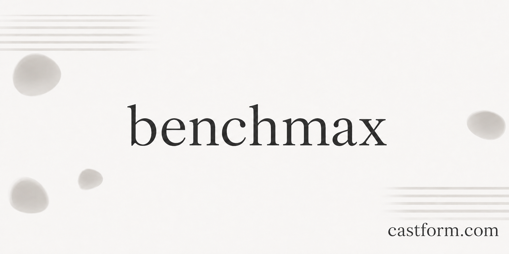

<picture>
  
</picture>

## benchmax — companion sdk for the castform training platform

benchmax is the python sdk for running training jobs on castform. see the [online docs](https://castform.com/docs/) for how to start training runs. you can use our pre-built recipes use-cases like [training rag agents](https://castform.com/docs/rag/guide/) or [training on production traces](https://castform.com/docs/traces/overview/). or you can [roll your own too](https://castform.com/docs/environments/overview/).

## Installation

```bash
uv pip install benchmax
```

python 3.12 required.

The base install is intentionally small. Add extras only for the env/data path
you use, for example `benchmax[rag]`, `benchmax[turbopuffer]`,
or `benchmax[telestich]`.

---

## License

apache 2.0 © 2026 cgft inc
