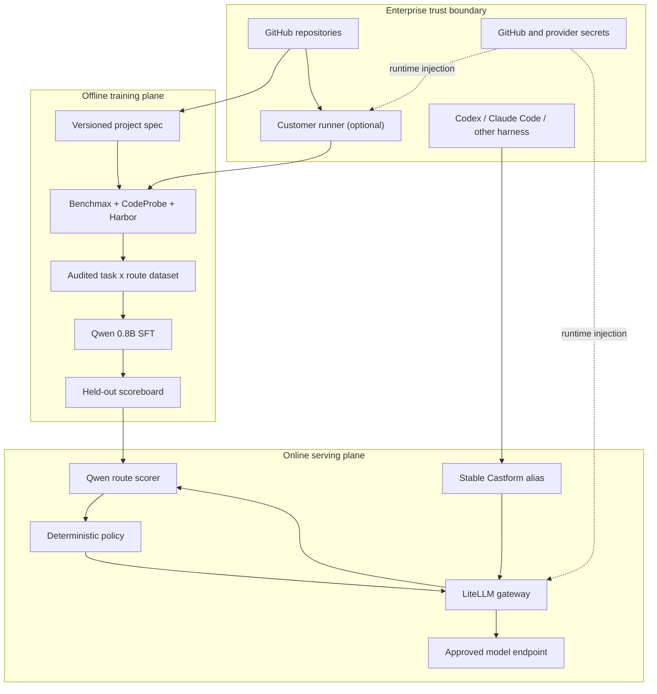
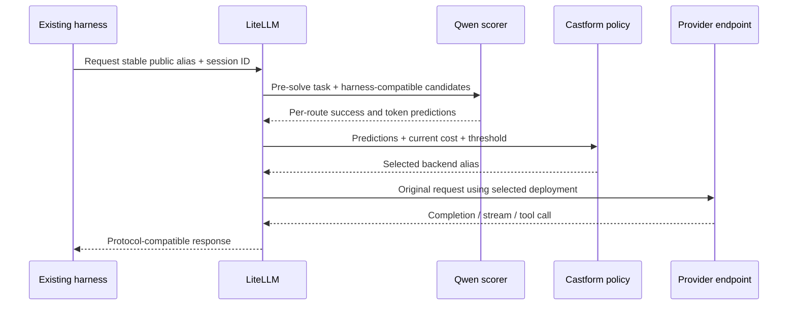

# Enterprise model router: end-to-end guide

This document explains how an enterprise brings repositories, chooses coding
agent routes, produces a repository-specific routing dataset, trains and
evaluates the small router, and puts LiteLLM in front of approved model
deployments.

The short version is:

1. The enterprise declares repositories, credential references, and at least
   two approved harness/model/provider routes in a versioned project spec.
2. Castform creates a dry-run workspace and a reviewable execution plan.
3. Benchmax mines historical pull requests, reconstructs leak-guarded tasks,
   rejects tasks whose tests do not distinguish the fix from a no-op, and runs
   every surviving task against every approved route.
4. The audited task-by-route matrix becomes supervised training data for a
   Qwen 3.5 0.8B scorer.
5. The scorer predicts success and token use for every eligible route. It does
   not make the final cost or availability decision.
6. Deterministic policy selects a route using the predictions and current
   operational data.
7. LiteLLM resolves the selected stable alias to the enterprise's provider or
   self-hosted model endpoint, owns provider credentials, and records call-level
   telemetry.

## What the MVP contains

The repository contains two related routing paths. They share the prediction
contract and LiteLLM gateway, but they start at different layers.

| Path | What Castform selects | When to use it | MVP status |
| --- | --- | --- | --- |
| Job-level routing | Harness + model + provider | Castform receives the coding task before an agent starts | Router, policy, scorer call, session pinning, and tracing work; the local harness launch is simulated |
| In-harness routing | Model deployment only | Codex, Claude Code, OpenCode, or another harness is already running | LiteLLM callback, scorer call, model rewrite, pinning, override, fallback, and protocol smoke tests work |

The local stack uses mock downstream providers by default. It proves contracts,
transport, routing behavior, and traces without spending provider credits. It
does not yet provide production-grade harness supervisors, durable session
state, a secrets manager, or a hosted control plane.

## Architecture and trust boundaries



The planes have intentionally different permissions:

- The training plane may clone repositories and execute repository tests in an
  isolated sandbox. It should not receive production provider credentials
  unless it is actively collecting approved benchmark rollouts.
- The serving plane receives task prompts and model traffic. It does not need
  GitHub clone credentials.
- LiteLLM owns downstream provider credentials. The learned router sees route
  metadata, task context, and candidate IDs—not API keys or raw price tables.
- The deterministic policy owns mutable business inputs such as current cost,
  quality threshold, provider health, deny lists, and manual overrides.

## 1. Declare the enterprise project

Start from `examples/router-project.json`. The project file is intended to be
reviewed and committed like infrastructure configuration; secret values never
belong in it.

```json
{
  "schema_version": "1",
  "name": "acme-router-v1",
  "auth_profiles": {
    "acme-github": {
      "strategy": "github_app",
      "app_id_env": "CASTFORM_GITHUB_APP_ID",
      "private_key_env": "CASTFORM_GITHUB_PRIVATE_KEY",
      "installation_id_env": "CASTFORM_GITHUB_INSTALLATION_ID",
      "installation_token_env": "CASTFORM_GITHUB_INSTALLATION_TOKEN"
    }
  },
  "repositories": [
    {
      "repo": "acme/api",
      "revision": "main",
      "auth_profile": "acme-github"
    },
    {
      "repo": "acme/web",
      "revision": "release/2026-q3",
      "auth_profile": "acme-github"
    },
    {
      "repo": "acme/worker",
      "revision": "main",
      "auth_profile": "acme-github"
    }
  ],
  "pull_requests": {
    "limit_per_repo": 20,
    "eval_ratio": 0.2,
    "include_body": false,
    "exclude_labels": ["dependencies", "generated"]
  },
  "allowed_routes": [
    "claude-code/sonnet@anthropic",
    "codex/5.6-balanced@openai",
    "codex/5.6-deep@openai"
  ],
  "benchmark": {
    "repetitions": 3,
    "average_run_cost_usd": 0.75,
    "execution": "customer_runner"
  }
}
```

### Add or remove repositories

Each `repositories` entry is a full-history mining source. Add another object
to include another repository; remove the object to exclude it from future
workspaces. The current contract accepts GitHub `owner/repo` identifiers or
HTTPS GitHub URLs, a revision, and an auth profile. It supports up to 100
repositories.

Use a stable branch or tag in `revision`. A generated workspace captures the
spec and execution plan, but the current MVP does not resolve a moving branch
name to an immutable commit in the project file. For a reproducible production
run, archive the resolved commit SHAs with the resulting dataset and model.

Repositories are deduplicated by normalized `owner/repo`. Repository names
must also be unique across owners for the current upstream dataset builder; for
example, `acme/api` and `subsidiary/api` cannot be processed in the same run.

### Repository authentication

The three supported auth strategies are:

| Strategy | Intended use | Value stored in the spec |
| --- | --- | --- |
| `public` | Public GitHub repository | No credential reference |
| `token_env` | Short-lived pilot or CI token | Environment variable name such as `GITHUB_TOKEN` |
| `github_app` | Production private-repository access | Environment variable names for App ID, private key, installation ID, and optional installation token |

Use a GitHub App for production. Grant it read-only access to contents,
metadata, and pull requests on only the repositories in scope. Inject values at
runtime from the enterprise secrets manager. The project validator accepts
uppercase environment-variable references and never needs the secret value.

For `customer_runner`, clone credentials and source stay inside the enterprise
environment. For `castform_hosted`, the enterprise authorizes a temporary,
isolated Castform runner. Private repositories should default to
`customer_runner` until hosted-runner retention, residency, and access controls
have passed the enterprise security review.

### Choose the model routes

A route is a complete tuple, not just a model name:

```text
harness/model@provider
```

`allowed_routes` is the allowlist used for collection, training, evaluation,
and serving policy. At least two routes are required; otherwise there is
nothing to learn or select.

The MVP catalog currently supports:

| Route ID | Harness | Model tier | Provider |
| --- | --- | --- | --- |
| `claude-code/opus@anthropic` | Claude Code | Opus | Anthropic |
| `claude-code/sonnet@anthropic` | Claude Code | Sonnet | Anthropic |
| `claude-code/haiku@anthropic` | Claude Code | Haiku | Anthropic |
| `claude-code/glm-5.1@zai` | Claude Code | GLM 5.1 | Z.AI |
| `codex/5.6-fast@openai` | Codex | 5.6 Fast | OpenAI |
| `codex/5.6-balanced@openai` | Codex | 5.6 Balanced | OpenAI |
| `codex/5.6-deep@openai` | Codex | 5.6 Deep | OpenAI |

These names are stable product-level route IDs. Each maps to a concrete Harbor
agent/model during benchmark collection and to a concrete LiteLLM model alias
during serving.

Arbitrary route strings are deliberately not accepted by the workspace
generator. To add an enterprise deployment, add a reviewed `TrainingRoute` to
`castform_router/training_environment.py`, validate the harness/model protocol
with Harbor, add the corresponding LiteLLM deployment alias, add it to the
gateway candidate allowlist, and rerun the full matrix. This is the current
MVP promotion path; a future control plane can turn it into self-service route
registration without weakening validation.

Do not treat a successful one-shot completion as route compatibility. A route
must pass the harness's streaming, tool-call, context-window, cancellation,
retry, and error-shape tests.

### Estimate the run before spending

The planning estimate is:

```text
planned tasks    = repositories x tasks_per_repo
planned rollouts = planned tasks x allowed routes x repetitions
estimated cost   = planned rollouts x average_run_cost_usd
```

This is a planning ceiling, not a bill. Mining and gating can reduce the number
of tasks that reach collection. Conversely, retries and unusually long tasks
can increase actual spend. Use provider budget controls as the authoritative
limit.

## 2. Validate and prepare without side effects

From `packages/castform/litellm-router`:

```bash
uv run castform-router validate examples/router-project.json

uv run castform-router prepare examples/router-project.json \
  --output training_runs
```

`validate` only reads the file. `prepare` creates a local workspace and writes
the exact Benchmax commands but does not clone repositories, run tests, or call
models. Review these files before execution:

```text
training_runs/<workspace-id>/
├── project.spec.json
├── manifest.json
├── NEXT_STEPS.md
├── benchmax/
│   ├── environment.json
│   ├── task_schema.json
│   └── model_router/workflow-plan.json
├── router/
│   ├── training_contract.json
│   └── training_config.json
└── litellm/route_registry.json
```

The important review questions are:

- Are the exact repositories and revisions correct?
- Does every private repository use the intended auth profile?
- Is execution occurring in the approved trust boundary?
- Are only approved harness/model/provider routes present?
- Is the planned task, rollout, and cost count acceptable?
- Does the generated command keep agent network access at `allowlist`?

## 3. Mine and qualify tasks

Execute only through the gate first:

```bash
uv run castform-router benchmax training_runs/<workspace-id> \
  --through gate \
  --agent-network allowlist \
  --gate-k 3 \
  --execute
```

The stages are:

1. **Setup.** Locate or clone the authoritative Benchmax `model-router`
   workflow and create isolated CodeProbe and Harbor Python environments.
2. **Mine.** Clone full repository history and use CodeProbe to identify
   historical coding tasks. The default is deterministic `--no-llm`; enabling
   `--codeprobe-llm` intentionally spends credits to enrich instructions.
3. **Convert.** Reconstruct each task at its pre-change base commit and overlay
   PR-era tests without leaking the implementation patch.
4. **Gate.** Run the oracle patch and a no-op repeatedly. Keep a task only when
   the oracle passes every run and the no-op fails every run.

The gate is what turns repository history into useful supervised evidence.
Without it, a green test could mean the task was already solved, the verifier
was too weak, or the reconstructed environment was wrong.

Review every generated `harbor_tasks/<repo>/manifest.json`. Remove tasks with
secrets, customer data, licensing restrictions, nondeterministic dependencies,
or requirements that the sandbox cannot faithfully reconstruct.

## 4. Collect the complete task-by-route matrix

After approving the gated tasks:

```bash
uv run castform-router benchmax training_runs/<workspace-id> \
  --from-stage collect \
  --through scoreboard \
  --concurrency 4 \
  --router-rung knn \
  --execute
```

Collection runs every surviving task on every approved route for the specified
number of repetitions. It records verifier success, cost, latency, input and
output tokens, cache reads, tool calls, trajectories, and failure categories.

The next stages are:

1. **Trajectory audit.** Reject malformed, contaminated, or policy-violating
   runs before they enter the dataset.
2. **Dataset build.** Join pre-solve task features with measured post-run
   outcomes and create temporal/repository-aware splits.
3. **Router rung.** Run kNN, profile, or zero-shot selection as an interpretable
   baseline.
4. **Scoreboard.** Compare the router with every always-route policy, random
   choice, and the oracle ceiling.

Only information available before solving belongs in router input: task text,
declared user context, repository/language metadata, available tools, and the
candidate route descriptions. Solutions, future patches, verifier outcomes,
held-out costs, secrets, live prices, and provider health are leakage.

## 5. Train and evaluate the small scorer

Format the audited matrix:

```bash
uv run castform-router format-training-data \
  training_runs/<workspace-id> \
  --held-out-repo acme/worker
```

Use at least one whole held-out repository when possible. A temporal split
inside the same repositories is useful, but it does not fully test whether the
router generalizes to an unfamiliar codebase.

Train the LoRA adapter:

```bash
uv sync --extra training
uv run castform-router train-sft training_runs/<workspace-id>
```

The default is `Qwen/Qwen3.5-0.8B`. The assistant target contains a prediction
for every candidate route:

- success probability;
- expected input tokens;
- expected cache-read tokens;
- expected output tokens.

The model does not encode a permanent price preference. Keeping cost and
availability outside the checkpoint lets operations change providers, prices,
thresholds, and incident policy without retraining.

Serve the adapter or merged checkpoint behind an OpenAI-compatible endpoint,
then configure the stable LiteLLM scorer alias:

```bash
export CASTFORM_ROUTER_UPSTREAM_MODEL=openai/qwen35-08b-router
export CASTFORM_ROUTER_UPSTREAM_BASE_URL=http://router-serving.internal:8000/v1
export CASTFORM_ROUTER_UPSTREAM_API_KEY="$ROUTER_SERVING_API_KEY"
export CASTFORM_ROUTER_MODEL_NAME=castform-router-0.8b
```

Run held-out evaluation through the same gateway path used in production:

```bash
uv run castform-router evaluate-trained training_runs/<workspace-id>
```

The evaluator validates strict JSON, emits Benchmax-compatible picks, measures
Brier score and token-count error, and produces the scoreboard command. Do not
promote solely because training loss decreased.

Recommended promotion gates are:

- every response passes the strict schema;
- calibration and task-level utility beat the cheapest acceptable baseline;
- the router beats every always-route policy at the chosen quality constraint;
- held-out-repository performance is acceptable;
- fallback, override, timeout, retry, and provider outage tests pass;
- shadow-mode decisions match policy expectations before control is enabled.

## 6. Configure LiteLLM and the enterprise gateway

There are three distinct names in the serving configuration:

| Name | Example | Purpose |
| --- | --- | --- |
| Public alias | `castform-auto-codex` | Stable name configured in the caller |
| Scorer alias | `castform-router-0.8b` | Stable gateway name for the Qwen router |
| Backend alias | `codex-route` | Concrete deployment selected by policy |

The caller never needs a provider model ID. The model router never needs a
provider API key. LiteLLM connects aliases to provider endpoints and secrets.

### Downstream model deployments

Copy `examples/in-harness.env.example` to the ignored `.env` file and replace
the placeholders. A typical deployment uses:

```dotenv
LITELLM_MASTER_KEY=<secret-from-vault>

CASTFORM_CODEX_ROUTE_MODEL=openai/<approved-openai-api-model-id>
CASTFORM_CODEX_ROUTE_BASE_URL=https://api.openai.com/v1
CASTFORM_CODEX_ROUTE_API_KEY=<secret-from-vault>

CASTFORM_CLAUDE_ROUTE_MODEL=anthropic/<approved-claude-api-model-id>
CASTFORM_CLAUDE_ROUTE_BASE_URL=https://api.anthropic.com
CASTFORM_CLAUDE_ROUTE_API_KEY=<secret-from-vault>
```

Provider subscription sessions are not API credentials. Traffic routed by
LiteLLM is billed to the API credential or self-hosted endpoint configured on
the backend alias.

### Candidate allowlist and live policy inputs

`CASTFORM_AUTO_ROUTES_JSON` tells the callback which concrete aliases it may
consider. Every entry contains:

- `gateway_model`: an alias present in `litellm_config.yaml`;
- `model` and `provider`: metadata sent to the scorer;
- `estimated_cost_usd`: live policy input, not learned-model input;
- `compatible_harnesses`: the harness protocols approved for this backend.

Example:

```json
[
  {
    "gateway_model": "codex-route",
    "model": "<approved-openai-api-model-id>",
    "provider": "openai",
    "estimated_cost_usd": 0.18,
    "compatible_harnesses": ["codex", "openai-compatible"]
  },
  {
    "gateway_model": "claude-route",
    "model": "<approved-claude-api-model-id>",
    "provider": "anthropic",
    "estimated_cost_usd": 0.30,
    "compatible_harnesses": ["claude-code", "openai-compatible"]
  }
]
```

Set `CASTFORM_AUTO_FALLBACK_MODEL` to one of those `gateway_model` values and
set `CASTFORM_ROUTER_QUALITY_THRESHOLD` to the approved minimum probability.
Startup fails if the fallback is not in the candidate set. Duplicate backend
aliases, negative cost estimates, or empty harness allowlists are also rejected.

The training allowlist and serving allowlist must describe the same effective
routes. A route may be removed during an incident, but a route that the model
never saw during training must not be silently introduced into production.

### Caller integration

For an already-running harness, point the caller at LiteLLM:

| Caller | Base URL | Public alias | Wire protocol |
| --- | --- | --- | --- |
| Codex | `https://gateway.example.com/v1` | `castform-auto-codex` | OpenAI Responses |
| Claude Code | `https://gateway.example.com` | `castform-auto-claude` | Anthropic Messages |
| OpenCode/custom app | `https://gateway.example.com/v1` | `castform-auto-open` | OpenAI-compatible chat |

Send these request-scoped values as metadata or headers:

| Value | Header | Why |
| --- | --- | --- |
| Session ID | `x-castform-session-id` | Pins one backend for a multi-turn agent session |
| Trace ID | `x-castform-trace-id` | Correlates scorer, policy, gateway, and provider events |
| Route override | `x-castform-route` | Forces an eligible backend alias for diagnosis or policy intervention |

See `HARNESS_SETUP.md` for complete Codex, Claude Code, and OpenAI-compatible
client examples.

## 7. Online request lifecycle

The in-harness path is:



The callback follows this order:

1. Identify the public alias and therefore the already-running harness.
2. Build only the candidates whose `compatible_harnesses` contains that harness.
3. Extract task text plus allowed user/workspace context.
4. Scope the session pin by harness so Codex and Claude Code cannot collide.
5. Call the Qwen scorer through `castform-router-0.8b` on LiteLLM.
6. Validate that the scorer returned exactly one prediction for every candidate.
7. Select the cheapest route at or above the quality threshold. If none clear
   the threshold, select the highest predicted success probability.
8. Rewrite the public alias to the selected backend alias.
9. Let LiteLLM perform provider authentication, transport, retries, and
   response adaptation.
10. Reuse the selected backend for later calls with the same session ID until
    the TTL expires.

If scoring fails, the callback uses the configured fallback and records
`router_error_fallback`. A manual override still must name an eligible route.
The current pin store is process-local memory; production needs Redis or an
equivalent shared TTL store before running multiple gateway replicas.

The job-level path performs the same scoring and policy steps before starting a
harness. That is the only path that can choose between Codex and Claude Code.
LiteLLM alone cannot change the harness after the harness has already produced
a model request.

## 8. Operate, observe, and roll back

Every request should carry a trace ID across the public alias, scorer call,
policy decision, backend rewrite, and provider call. The local viewer exposes
raw traces at `http://localhost:3000`; it is development software and must not
be exposed to customer traffic.

Production telemetry should record at least:

- project, route-registry, router-model, policy, and price-table versions;
- eligible candidates and selected route;
- prediction vector, decision reason, threshold, override, and cache-hit flag;
- provider latency, token counts, retries, status, and normalized failure type;
- verifier outcome when it becomes available asynchronously;
- hashed or redacted tenant, repository, session, and trace identifiers.

Do not log repository contents, full prompts, patches, secrets, or provider
responses by default. Apply enterprise retention, residency, and deletion
policies separately to training artifacts and online traces.

A safe rollout progresses through:

1. **Offline:** compare against always-route, random, and oracle baselines.
2. **Shadow:** compute decisions but keep the existing production route.
3. **Canary:** enable control for a small tenant/task percentage with a hard
   fallback and provider budget limits.
4. **Ramp:** expand only while quality, cost, latency, and failure metrics stay
   inside the agreed envelope.
5. **Rollback:** route the public alias directly to the approved fallback, then
   remove the failing candidate from `CASTFORM_AUTO_ROUTES_JSON`.

Model rollback and policy rollback are independent. An operator can restore a
previous scorer checkpoint without changing prices, or restore a previous
policy/route registry without changing the checkpoint.

## Enterprise responsibility matrix

| Area | Enterprise | Castform / platform |
| --- | --- | --- |
| Repository scope and lawful use | Approves repos, revisions, retention, and task use | Enforces declared scope and produces audit artifacts |
| GitHub credentials | Owns App/token and least-privilege grants | Reads only referenced environment variables at runtime |
| Provider contracts and budgets | Approves model providers, keys, regions, and limits | Routes only to allowlisted aliases and reports usage |
| Sandbox location | Chooses customer or Castform runner | Implements plan in the selected trust boundary |
| Route quality | Defines acceptance thresholds and business objectives | Runs Benchmax, calibration, scoreboard, and shadow evaluation |
| Production operations | Approves rollout and incident policy | Supplies fallback, override, pinning, trace, and version hooks |

## Current MVP gaps before production

The following items are intentionally visible rather than hidden behind the
demo:

- job-level harness adapters simulate launch and supervision;
- session pins are in-memory and not shared across replicas;
- the route catalog is code-reviewed rather than self-service;
- LiteLLM backend aliases are configured in YAML/environment variables rather
  than generated and reconciled by a control plane;
- the local trace viewer stores raw prompt data and has no production auth or
  redaction boundary;
- the project spec supports GitHub only;
- hosted-runner isolation, regional storage, retention, and deletion require a
  production platform implementation;
- actual provider price ingestion and health-aware suppression are policy
  inputs described by the architecture but not automated by the local lab.

Those gaps do not block local contract validation or customer-runner pilots.
They do block describing the current lab as a turnkey multi-tenant production
service.

## Local acceptance test

Run the full zero-key contract test before connecting enterprise credentials:

```bash
uv run --with pytest pytest -q
uv run --with ruff ruff check .

docker compose up -d
docker compose ps
uv run python scripts/smoke_test.py
```

The smoke test covers strict scorer output, Chat Completions, OpenAI Responses,
Anthropic Messages, explicit routes, automatic routes, session pinning, and
streaming against the mock upstream. After replacing a mock backend, rerun the
same suite and then add harness-specific tool and long-running session tests
before allowing that deployment into the candidate set.
