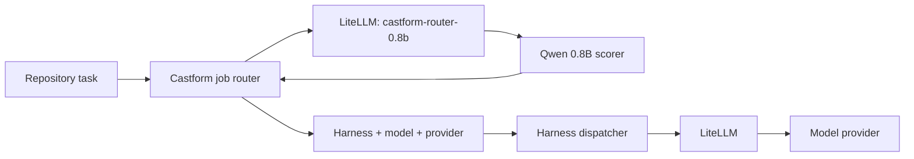
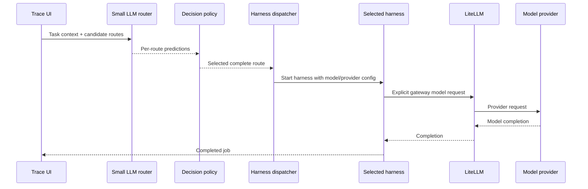

# Castform harness router lab

A local, zero-key stack for designing and tracing a trained router that chooses
a complete coding-agent route:

```text
harness + model + provider
```

The stack includes:

- a Castform job router and harness dispatcher;
- a LiteLLM proxy at `http://localhost:4000`;
- a stable LiteLLM alias, `castform-router-0.8b`, for the small scorer;
- a request trace viewer at `http://localhost:3000`;
- mock GLM, Codex, and Claude Code routes with no provider spend.

To route models from an already-running Codex, Claude Code, OpenCode, or local
OpenAI-compatible client, see [HARNESS_SETUP.md](HARNESS_SETUP.md). That path
uses Qwen inside the LiteLLM callback and does not require the `castform task`
launcher.

The zero-key default sends the scorer request through LiteLLM to a mock 0.8B
upstream. The mock has no routing intelligence; it exists to prove that the
prompt, strict JSON Schema, LiteLLM forwarding, response parsing, and job policy
are connected before downloading or fine-tuning a checkpoint.

## Start the lab

```bash
cd /Users/jasonwong/Desktop/benchmax/packages/castform/litellm-router
docker compose up -d
docker compose ps
uv run python scripts/smoke_test.py
```

The smoke test fails unless the router returns exactly one valid prediction for
every candidate route. It also exercises the existing explicit, automatic,
pinned, and streaming gateway calls.

To replace the mock with a stock 0.8B model on Apple Silicon, use Docker Model
Runner's llama.cpp backend with the Q4 GGUF. The raw Safetensors checkpoint
currently selects `vllm-metal`, whose bundled MLX version does not recognize
the `qwen3_5` architecture.

```bash
docker desktop enable model-runner --tcp=12434
docker model pull hf.co/unsloth/Qwen3.5-0.8B-GGUF:Q4_K_M

export CASTFORM_ROUTER_UPSTREAM_MODEL='openai/huggingface.co/unsloth/qwen3.5-0.8b-gguf:Q4_K_M'
export CASTFORM_ROUTER_UPSTREAM_BASE_URL=http://model-runner.docker.internal/engines/v1
export CASTFORM_ROUTER_UPSTREAM_API_KEY=not-needed
docker compose up -d --force-recreate litellm trace-ui
uv run python scripts/smoke_test.py
```

The public `castform-router-0.8b` alias and calling code stay unchanged when the
upstream later becomes a fine-tuned or merged checkpoint.

Open [http://localhost:3000](http://localhost:3000), enter a task, and select
**Route and run task**.

Or submit a task from the repository terminal and print the complete trace:

```bash
uv run castform task "Write a script that lists every Python file in this repo."
```

The command sends the current directory as workspace context and prints the
main Qwen, Castform, LiteLLM, approval, and coding-harness steps. Use
`--verbose` to print every low-level trace event, `--session my-session` to
demonstrate route pinning, `--route ROUTE_ID` for an explicit override, or
`--json` for machine-readable output. The local lab simulates the selected
harness and downstream provider; it does not edit the repository.

Select **Launch guided Click demo** to create a $0 simulated workspace and
advance through all eight Benchmax stages in the browser. Each stage displays
the actual upstream commands from `workflow-plan.json`, the artifact it would
create, and illustrative output. Simulation state is clearly labeled and
never clones a repository, executes tests, launches Harbor, or calls a model.
Use the generated CLI command when you are ready to execute the real workflow
on Castform Cloud or customer infrastructure.

The browser also shows the P4 handoff after the scoreboard: audited dataset,
Qwen 0.8B SFT, held-out picks, and publication. The contract, formatter,
LoRA trainer, and OpenAI-compatible scorer client are implemented. P4 remains
data-gated because the Click walkthrough is not enough data to train a useful
router.

The top of the page also contains the customer onboarding workflow:

1. Add public GitHub URLs or configure private repository identifiers.
2. Select the exact harness/model/provider routes the customer approves.
3. Choose pull-request count, repetitions, average rollout cost, execution
   location, and the kNN, Profile, or Zero-shot router rung.
4. Generate a local Castform + Benchmax training workspace.

Select **Try with pallets/click** to populate the flow with a compact,
public Python repository that has a mature test suite and useful issue history.

For the production-oriented view—including repository and credential ownership,
the supported route catalog, gateway configuration, training and serving data
flows, rollout gates, failure behavior, and the current MVP boundaries—read
[Enterprise end-to-end guide](ENTERPRISE_E2E.md).

Training uses the existing Benchmax `examples/model_router` workflow. CodeProbe
mines full repository history, the Benchmax converter creates leak-guarded
Harbor tasks with PR-era test overlays, and `gate_tasks.py` keeps a task only
when every oracle run passes and every no-op run fails.

## Code-first project spec

The UI and CLI call the same workspace generator. Teams can commit a versioned
JSON spec and avoid the UI entirely:

```json
{
  "schema_version": "1",
  "auth_profiles": {
    "company-github": {
      "strategy": "github_app",
      "app_id_env": "CASTFORM_GITHUB_APP_ID",
      "private_key_env": "CASTFORM_GITHUB_PRIVATE_KEY",
      "installation_id_env": "CASTFORM_GITHUB_INSTALLATION_ID",
      "installation_token_env": "CASTFORM_GITHUB_INSTALLATION_TOKEN"
    }
  },
  "repositories": [
    {
      "repo": "acme/api",
      "revision": "main",
      "auth_profile": "company-github"
    },
    {
      "repo": "acme/web",
      "revision": "main",
      "auth_profile": "company-github"
    }
  ],
  "pull_requests": {
    "limit_per_repo": 20,
    "eval_ratio": 0.2,
    "include_body": false,
    "exclude_labels": ["dependencies"]
  },
  "allowed_routes": [
    "claude-code/opus@anthropic",
    "claude-code/sonnet@anthropic",
    "codex/5.6-balanced@openai",
    "codex/5.6-deep@openai"
  ],
  "benchmark": {
    "repetitions": 1,
    "average_run_cost_usd": 0.75,
    "execution": "castform_hosted"
  }
}
```

`castform_hosted` is the default and fastest path: qualification and
Benchmax rollouts run in an isolated, temporary Castform Cloud sandbox. Use
`customer_runner` when repository code and credentials must stay inside the
customer's cloud, VPC, or CI environment. The UI recommends customer-hosted
execution when a private or GitHub App-backed repository is added, and it
always shows where private code will run before creating the workspace.

Credential fields name environment variables; they never contain a token,
private key, or installation ID value. One auth profile can be reused across
all repositories belonging to the same GitHub App installation.

```bash
export CASTFORM_GITHUB_APP_ID=...
export CASTFORM_GITHUB_PRIVATE_KEY=...
export CASTFORM_GITHUB_INSTALLATION_ID=...
export CASTFORM_GITHUB_INSTALLATION_TOKEN=...

uv run castform-router validate examples/router-project.json
uv run castform-router prepare examples/router-project.json \
  --output training_runs
```

`prepare` creates the workspace and writes a dry-run plan over Benchmax's
existing scripts. It does not clone repositories, execute tests, or spend
model credits. Live mining defaults to CodeProbe's deterministic `--no-llm`
mode. Pass `--codeprobe-llm` only when you intentionally want paid model
enrichment of mined task instructions:

```bash
uv run castform-router benchmax training_runs/<workspace-id> \
  --through gate --execute
```

After reviewing `harbor_tasks/*/manifest.json`, run the remaining collection,
dataset, baseline, and scoreboard stages:

```bash
uv run castform-router benchmax training_runs/<workspace-id> \
  --from-stage collect --through scoreboard --execute
```

The second command also spends model credits during Harbor collection. Without
`--execute`, every command is printed and persisted as a dry run. Use
`--router-rung knn` (the default), `profile`, or `baseline` to select one of
the existing Benchmax baselines. Profile and Zero-shot also accept
`--router-model`; both spend model credits, while kNN is free. The browser
exposes the same choices and updates its Step 6 command and picks artifact.
`materialize` remains only as a legacy metadata prototype and is not part of
the training path.

See the complete [example project](examples/router-project.json) and
[project JSON Schema](schemas/router-project.schema.json). The frozen learned
boundary is also available as
[router-request.schema.json](schemas/router-request.schema.json) and
[router-response.schema.json](schemas/router-response.schema.json).

### How pull requests become router labels

```mermaid
flowchart LR
    Repos["Full repository clones"] --> Mine["CodeProbe mine"]
    Mine --> Convert["convert_to_harbor.py"]
    Convert --> Gate["gate_tasks.py: oracle passes, nop fails"]
    Gate --> Collect["Harbor run per allowed route"]
    Collect --> Audit["audit_trajectories.py"]
    Audit --> Dataset["build_dataset.py"]
    Dataset --> Rung["kNN / profile / zero-shot rung"]
    Rung --> Score["scoreboard.py"]
    Score --> Train["Train only after beating baselines"]
```



The training row contains only pre-solve features as router input and measured
post-run outcomes as labels. Useful labels include verifier success, cost,
latency, tokens, tool calls, and failure category.

Public repositories are inspected using GitHub's public repository API. Private
repositories remain unverified until a production GitHub App is installed; the
local lab never asks for or stores a GitHub token.

Generated workspaces are written to `training_runs/<workspace-id>/`. The
Benchmax workflow populates the following authoritative artifacts:

```text
manifest.json
project.spec.json
NEXT_STEPS.md
benchmax/
├── environment.json
├── task_schema.json
└── model_router/
    ├── workflow-plan.json
    ├── workflow-trace.jsonl
    ├── repos/
    ├── harbor_tasks/
    │   └── <repo>/manifest.json
    ├── gate_runs/
    ├── harbor_runs/
    ├── dataset.jsonl
    └── router_outputs/
router/
├── training_contract.json
├── checkpoints/
└── reports/
litellm/
└── route_registry.json
```

`create` stops at `awaiting_task_extraction`. `prepare` advances the workspace
to `ready_for_benchmax_mining` and records the exact upstream source,
`benchmax/examples/model_router`. The CLI fetches the `model-router` branch
into the workspace only if a local `examples/model_router` checkout is not
available. Network allowlisting is the default and requires Linux or Modal;
use `--agent-network public` only for local macOS testing, where the workflow's
instruction and trajectory-audit layers remain but egress is not enforced.

The page shows:

1. normalized task, user context, and workspace context;
2. eligible harness/model/provider combinations;
3. the small-LLM prediction contract;
4. the deterministic cost-quality policy;
5. the selected harness starting;
6. the harness sending a model request through LiteLLM;
7. the provider request and response;
8. the completed job returned to the caller.

Keep the same session ID and submit a second task to see the complete execution
route reused without rescoring.

## Why harness routing happens above LiteLLM



LiteLLM receives model calls after an agent harness is already running. It
cannot retroactively decide whether Claude Code or Codex should have created
the call. The job router therefore selects and starts the harness first.
The job router now also uses LiteLLM as the transport for its 0.8B scorer; the
decision itself remains above LiteLLM. LiteLLM is responsible for model
credentials, provider transport, retries, fallbacks, and call-level telemetry
on both paths.

## Candidate route registry

The local registry contains three illustrative routes:

| Route ID | Harness | Model | Provider | LiteLLM alias |
| --- | --- | --- | --- | --- |
| `claude-code/glm-5.1@zai` | Claude Code | GLM 5.1 | Z.AI | `glm-route` |
| `codex/openai-codex@openai` | Codex | OpenAI Codex model | OpenAI | `codex-route` |
| `claude-code/claude-sonnet@anthropic` | Claude Code | Claude Sonnet | Anthropic | `claude-route` |

These are route-shape examples, not production model recommendations. Only
harness/model combinations validated by Benchmax should enter the production
registry.

## Trained-router input

The trained model receives only information available before solving:

```json
{
  "schema_version": "1",
  "request_id": "req_123",
  "task": {
    "text": "Debug a distributed race condition.",
    "domain": "software_engineering"
  },
  "user_context": {
    "declared_role": "developer"
  },
  "workspace_context": {
    "repository_type": "typescript",
    "tools": ["repository", "terminal", "tests"]
  },
  "candidate_routes": [
    {
      "route_id": "claude-code/glm-5.1@zai",
      "harness": "claude-code",
      "model": "glm-5.1",
      "provider": "zai"
    }
  ]
}
```

Do not include the solution, verifier result, future patch, API keys, current
prices, or provider health in the learned-model input.

## Benchmax router-rung output

The existing zero-shot, profile, and kNN rungs emit one JSONL pick per task:

```json
{
  "task_id": "c943271a",
  "model": "claude-opus-5",
  "reasoning": "Nearest historical tasks favor the frontier route.",
  "router_cost_usd": 0.0
}
```

`scoreboard.py` consumes this shape directly and compares it with every
always-route policy, random selection, and the oracle ceiling.

## Trained-router serving output

Benchmax does not prescribe the final 800M serving format. This workspace locks
the following v2 per-route scoring contract so the deployment policy can sweep
cost-quality tradeoffs without retraining:

```json
{
  "schema_version": "2",
  "router_model_version": "qwen35-08b-sft-v2",
  "predictions": [
    {
      "route_id": "claude-code/glm-5.1@zai",
      "success_probability": 0.8,
      "input_token_band": "under_64k",
      "cache_read_token_band": "under_64k",
      "output_token_band": "8k_16k"
    },
    {
      "route_id": "codex/openai-codex@openai",
      "success_probability": 0.88,
      "input_token_band": "under_64k",
      "cache_read_token_band": "under_64k",
      "output_token_band": "8k_16k"
    }
  ]
}
```

The model predicts outcomes. It does not choose according to a hard-coded
price preference.

The deterministic policy combines predictions with live data:

```json
{
  "quality_threshold": 0.84,
  "live_route_costs": {
    "claude-code/glm-5.1@zai": 0.08,
    "codex/openai-codex@openai": 0.18,
    "claude-code/claude-sonnet@anthropic": 0.3
  }
}
```

It then emits:

```json
{
  "selected_route": {
    "route_id": "codex/openai-codex@openai",
    "harness": "codex",
    "model": "openai-codex",
    "provider": "openai",
    "gateway_model": "codex-route"
  },
  "reason": "cheapest_above_quality_threshold",
  "policy_version": "cheapest-above-threshold-v1"
}
```

This separation lets prices, latency objectives, provider availability, and
customer policy change without retraining the LLM.

## Train the Qwen router

Start with supervised fine-tuning. Each example contains the pre-solve task and
all eligible routes; the assistant target contains measured success rates and
categorical token bands. Success targets use a Beta(1,1) posterior mean, so a
single pass/fail becomes 0.6667/0.3333 instead of false certainty at 1/0. Exact
mean token counts remain in audit-only label metadata, while the learned JSON
uses stable input, cache-read, and output bands. The formatter drops tasks
without full route coverage and creates temporal or whole-repository evaluation
splits. It does not add a synthetic user persona: user context should be added
only when the same field exists in both training data and production requests.

For the shared `castform-ai/model-router` corpus, scaffold the pinned six-route
baseline directly from a local checkout:

```bash
uv run castform-router scaffold-model-router-sft /path/to/model-router \
  --output training_runs/model-router-sft \
  --model claude-haiku-4-5 \
  --model claude-opus-5 \
  --model claude-sonnet-4-6 \
  --model gpt-5.6-luna \
  --model gpt-5.6-sol \
  --model gpt-5.6-terra
```

After the DeepSeek farm has complete task coverage, add its Claude Code route:

```bash
  --model deepseek-v4-flash
```

The provider is inferred from the served model, producing the route ID
`claude-code/deepseek-v4-flash@deepseek`. Do not add a partial DeepSeek sample
to the main SFT matrix: full-matrix filtering would reduce the whole training
set to only the sampled tasks. Partial traces remain useful for contract,
cost, and evaluator smoke tests.

This writes the source hash, route manifest, repo-temporal train/eval files,
training configuration, and example request/response contracts. It does not
start training. A route is included in the formatted dataset only when every
selected model has a verified outcome for that task.

After the Benchmax dataset stage:

```bash
uv run castform-router format-training-data \
  training_runs/<workspace-id> \
  --held-out-repo pallets/click

uv sync --extra training
uv run castform-router train-sft training_runs/<workspace-id>
```

The default checkpoint is `Qwen/Qwen3.5-0.8B`, trained with a LoRA adapter and
assistant-only loss. Use `--model Qwen/Qwen3.5-0.8B-Base` for the base-model
ablation. Start with the post-trained checkpoint because its instruction and
JSON prior lowers the data burden.

Serve the resulting adapter or merged checkpoint through an OpenAI-compatible
vLLM/SGLang endpoint using the served name `qwen35-08b-router`, then point the
existing LiteLLM alias at it:

```bash
export CASTFORM_ROUTER_UPSTREAM_MODEL=openai/qwen35-08b-router
export CASTFORM_ROUTER_UPSTREAM_BASE_URL=http://host.docker.internal:8000/v1
export CASTFORM_ROUTER_UPSTREAM_API_KEY=local
docker compose up -d --force-recreate litellm trace-ui
```

Evaluate the served model before enabling it:

```bash
uv run castform-router evaluate-trained training_runs/<workspace-id>
```

This validates every held-out JSON response, emits
`benchmax/model_router/router_outputs/picks_trained.jsonl`, reports Brier score
plus per-class token-band accuracy and representative total-token mean absolute
error, and prints the existing Benchmax `scoreboard.py` command to run next.
Route costs are means from the training split only; held-out outcome costs are
not leaked into selection.

Inside Compose, `CASTFORM_ROUTER_MODEL_BASE_URL` defaults to LiteLLM and
`CASTFORM_ROUTER_MODEL_NAME` defaults to `castform-router-0.8b`. Setting the
base URL explicitly remains available as a diagnostic bypass, but the normal
path keeps LiteLLM in front of the small scorer.

Do not start with RL. The complete Benchmax task × route matrix supplies direct
supervision. RL becomes relevant if the router later searches code, retrieves
traces, or makes several tool-assisted decisions.

## Request lifecycle



The trace stages are:

```text
client.task_submitted
job.request_normalized
route.candidates_built
router.candidates_scored
policy.route_selected
harness.started
harness.model_request
litellm.route_received
provider.request_received
provider.response_created
harness.completed
client.response_received
```

A pinned session replaces scoring and policy selection with
`session.pin_reused`.

## What is simulated

The job router and trace boundaries are real. The local harness launch is a
simulation: it emits `harness.started` and makes one OpenAI-compatible request
representing the harness's first model call. The provider is also a local mock.

Production work still requires harness adapters that start and supervise
Claude Code, Codex, or another agent in an isolated workspace.

## Call the in-harness Qwen router

The `castform-auto-open` alias invokes the same Qwen scorer used by the job
router, applies the deterministic policy, and rewrites the request to a
concrete LiteLLM backend alias:

```bash
curl http://localhost:4000/v1/chat/completions \
  -H 'Authorization: Bearer sk-local-dev' \
  -H 'Content-Type: application/json' \
  -d '{
    "model": "castform-auto-open",
    "messages": [{"role": "user", "content": "Debug a distributed race condition."}],
    "metadata": {"session_id": "curl-demo"}
  }'
```

Use `castform-auto-codex` for Responses API clients and
`castform-auto-claude` for Anthropic Messages clients. This path selects a
model alias but cannot choose or start a harness because the harness is already
running.

## Verification

```bash
uv run --with pytest pytest -q
uv run --with ruff ruff check .
python3 scripts/smoke_test.py
```

## Project layout

```text
litellm-router/
├── castform_router/
│   ├── job_router.py        # Complete-route registry, scorer, policy, pinning
│   ├── litellm_callback.py  # LiteLLM call-level adapter
│   ├── router_protocol.py   # v1 model I/O and OpenAI-compatible scorer client
│   ├── training_data.py     # Benchmax matrix → leak-safe SFT JSONL
│   ├── train_sft.py         # Qwen 0.8B LoRA trainer
│   ├── trained_evaluator.py # Held-out metrics and Benchmax picks
│   ├── policy.py            # Legacy model-only placeholder
│   ├── session_router.py    # Legacy model-only session affinity
│   ├── trace.py             # Local JSONL trace store
│   └── types.py             # Versionable router contracts
├── web/                     # HTML trace viewer
├── trace_ui.py              # Job orchestrator and local web server
├── training_runs/           # Generated, gitignored onboarding workspaces
├── mock_upstream.py         # OpenAI-compatible mock provider
├── litellm_config.yaml      # Gateway aliases and callback
└── compose.yaml             # Complete local stack
```

## Production checklist

1. Train, calibrate, and shadow the Qwen scorer on held-out repositories.
2. Keep the deterministic decision policy separate.
3. Add isolated subprocess/container adapters for each harness.
4. Replace in-memory session pins with Redis.
5. Replace mock LiteLLM deployments with real providers.
6. Redact traces and publish them to production observability.
7. Record route, model, policy, price-table, and registry versions.
8. Feed verifier outcomes into an offline, versioned training dataset.

## Trace data warning

The viewer records raw prompts, workspace context, predictions, and mock
responses. It is local-development software. Do not expose port 3000 publicly
or send secrets or customer data through it.
